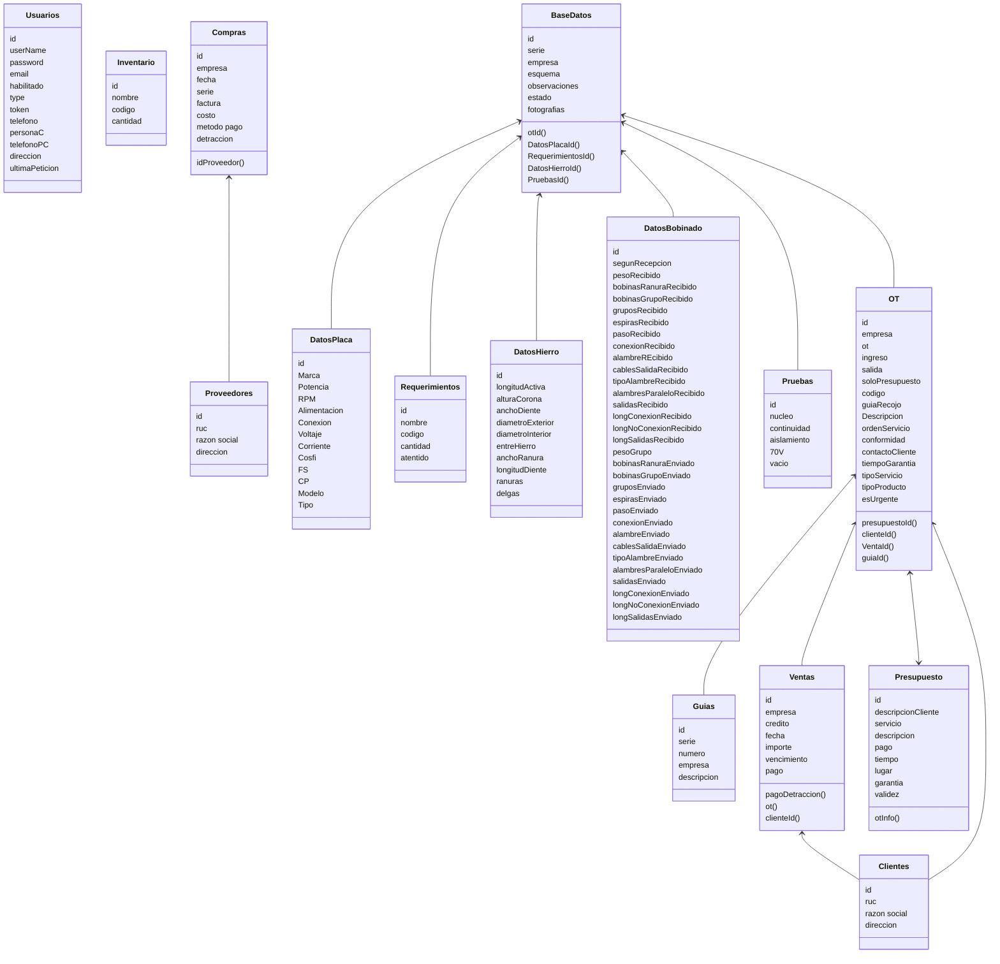

# PROYECTO ARTEMPA

El presente documento tiene como finalidad establecer los alcanes y funcionalidad del front y back del proyecto artempa, indica las direcciones y funcionalidad que debe tener cada componente y ruta.
Ademas indica si el componente será adaptado para funcionalidad desktop o mobile.
El proyecto tiene como objetivo ser el soporte en el registro y manejo de informacion en las actividades de mantenimiento de la empresa ABM y MEGAMAN, preservando los datos generales del servicio, asi como, los datos técnicos del procedimiento en el taller, para que estos puedan ser consultados en futuros trabajos o cuando el personal de oficina o taller lo necesite.
Se van a considerar 4 tipos de usuario: Admin, Planner, Contador, Tecnico
Considerar lo siguiente:
  - Si la ruta backend no lo indica, considerar que la informacion ha de ser enviada por body

## ROUTE MAP


## DATA BASE CLASS



## COMPONENTES GENERALES


### COMPONENTE __ CREAR CONTRASEÑA

**FRONT**
  1. Ubicacion: `/confirmar-pass/:token`
  1. Muestra un formulario con dos inputs para ingresar y confirmar la contraseña y un boton para enviar la informacion.
  1. Debe contener un boton para poder visualizar la contraseña en ambos inputs
  1. Debe mostrar errores cuando la contraseña:
      - Esté en blanco
      - No contenga al menos un numero
      - No contenga un caracter especial (| . - _ @ $ & #)
      - No contenga al menos una mayuscula
      - No coincida en los dos inputs
  1. El componente recibe el token que se generó cuando un usuario *Admin* le creo la cuenta.
  1. Debe mostrar un mensaje si el token ingresado no es válido
  1. Debe enviar un objeto con la informacion por body a la ruta `server/edit-password`
      - password hasheada
      - key
      - token
  1. Mientras se espera la peticion del servidor debe mostrar un loader 
  1. Si se presentó algun desperfecto o el token no es válido debe mostrar el mensaje: *Consulta con el usuario Admin*
  1. Si la contraseña se generó correctamente debe mostrar el mensaje: *Contraseña cambiada correctamente* y redirigirlo al componente login

**BACK**
  1. POST `/edit-password`, retorna un objeto
      - **answer** de tipo boolean que indica si el cambio fue exitoso o no
      - **message** de tipo string que indica 
  1. Debe verificar si el token ingresado es válido, en caso de no serlo debe retornar
      - **answer**: False
      - **message**: Token inválido
  1. En caso que el token sea valido, debe guardar la contraseña en el usuario correspondiente y eliminar el token  

### COMPONENTE __ LOGIN

**FRONT**
  1. Ubicacion `/login`
  1. Muestra un formulario con dos inputs para ingresar el usuario y contraseña, y un boton para enviar la informacion.
  1. Debe tener la opcion de poder ver la contraseña
  1. Si recibe una respuesta exitosa debe redirigir al componente HOME dependiendo del usuario

**BACK**
  1. GET `/login-acces?user=  pass=  `, retorna un objeto
      - **answer** de tipo boolean que indica si se puede acceder
      - **message** de tipo string que indica el mensaje
      - **token** de tipo string que sirve mientras el usuario se encuentra logeado
      - **userType** de tipo stringq ue indica el tipo de usuario


### COMPONENTE ___ HOME

**FRONT**
  1. Ubicacion: `/home-'typeUser'`
  1. Al renderizarce el componente padre de la ruta, debe de hacer una peticion al servidor para asegurarce que el token corresponde al tipo de usaurio
  1. Muestra los submenus donde puede acceder el usuario
  1. Debe mostrar un header condicional que indica donde se encuentra el usuario ej: *home>compras>...>etc*
  1. El header debe contener un un boton de retornar para regresar al menu anterior y un boton para regresar al home principal

**BACK**
  1. GET `/validate/:token`, que valida el token de inicio de sesion en la base de datos, retorna un objeto
      - **sucess** de tipo boolean que indica si puede acceder
      - **message** de tipo string ue indica el mensaje


## COMPONENTE ADMIN

```mermaid
  graph LR

```
